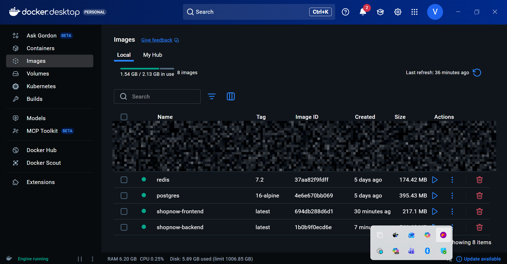
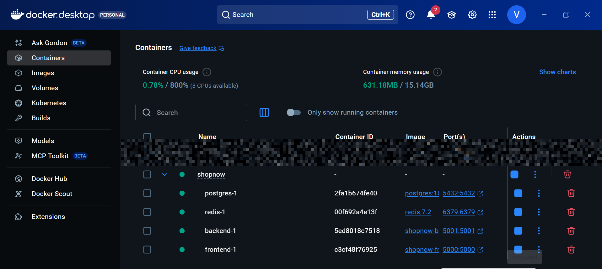
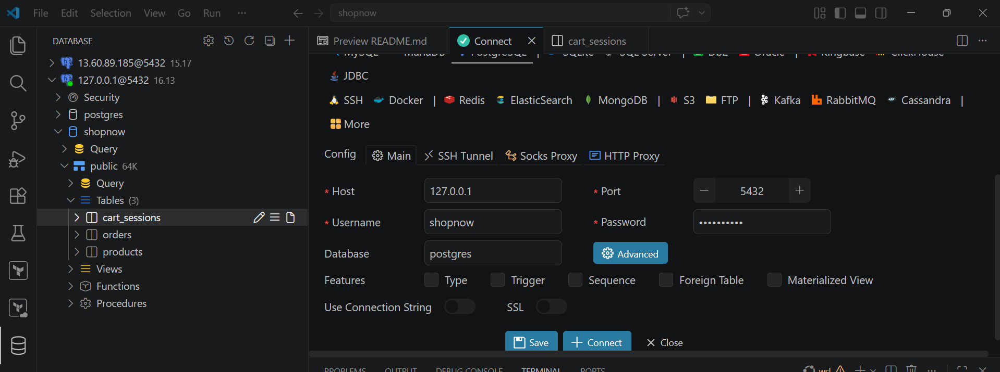
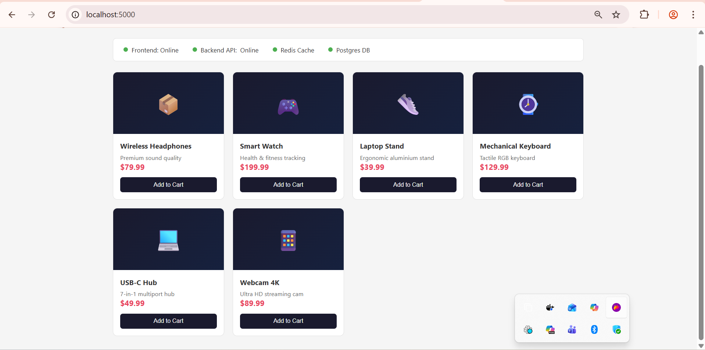

# Poly-Orchestrator — AWS ECS vs EKS Benchmark Project

> **Multi-Cloud Container Orchestration Project** | Comprehensive DevOps solution demonstrating both AWS ECS (Fargate) and Kubernetes (EKS) deployment strategies for a scalable e-commerce platform. Includes full Infrastructure as Code, service discovery, load balancing, and production-grade resiliency testing.

---

## Table of Contents

1. [Architecture Overview](#architecture-overview)
2. [Project Overview](#project-overview)
3. [Prerequisites](#prerequisites)
4. [Project Structure](#project-structure)
5. [Part 1: Local Development with Docker Compose](#part-1-local-development)
6. [Part 2: Infrastructure as Code with Terraform](#part-2-terraform)
7. [Part 3: ECS Fargate Deployment](#part-3-ecs-deployment)
8. [Part 4: EKS Deployment](#part-4-eks-deployment)
9. [Part 5: Resiliency Testing](#part-5-resiliency-testing)
10. [ECS vs EKS Comparison](#ecs-vs-eks-comparison)
11. [Troubleshooting](#troubleshooting)

---

## Project Overview

**Poly-Orchestrator** is an enterprise-grade DevOps engineering project designed to benchmark and compare two major AWS container orchestration platforms:

- **Amazon ECS (Fargate)** — Simplified, AWS-native container management
- **Amazon EKS (Kubernetes)** — Cloud-native, portable container orchestration

This project implements a complete, production-ready deployment of a multi-tier e-commerce platform on both platforms, allowing direct comparison of deployment complexity, operational burden, scalability, and cost.

---

## Architecture Overview

Poly-Orchestrator uses a 3-tier e-commerce application architecture:

```
Internet
    │
    ▼
[ Application Load Balancer ]
    │
    ▼
[ Frontend — Flask/Python — Port 5000 ]
    │  (talks to backend via service discovery)
    ▼
[ Backend API — Flask/Python — Port 5001 ]
    ├──▶ [ Redis 7 — Port 6379 ]  (session/cart caching)
    └──▶ [ Postgres 16 — Port 5432 ]  (orders, products)
```

**ECS Path:** ALB → Fargate tasks → Cloud Map DNS (`backend.shopnow.local`)  
**EKS Path:** ALB Ingress → ClusterIP Services → CoreDNS (`backend-service.shopnow.svc.cluster.local`)

### Docker Containerization





### Database Architecture



### Frontend Interface



## Prerequisites

| Tool         | Version   | Install                                      |
|--------------|-----------|----------------------------------------------|
| AWS CLI      | >= 2.x    | https://docs.aws.amazon.com/cli/latest/userguide/install-cliv2.html |
| Docker       | >= 24.x   | https://docs.docker.com/get-docker/          |
| Terraform    | >= 1.5.0  | https://developer.hashicorp.com/terraform/install |
| kubectl      | >= 1.29   | https://kubernetes.io/docs/tasks/tools/      |
| git          | any       | https://git-scm.com/                         |
| Helm         | >= 3.x    | https://helm.sh/docs/intro/install/          |

**AWS Permissions Required:**  
`AmazonECS_FullAccess`, `AmazonEKSFullAccess`, `AmazonEC2FullAccess`, `AmazonVPCFullAccess`, `AmazonECRFullAccess`, `CloudWatchFullAccess`, `IAMFullAccess`, `AWSCloudMapFullAccess`

---

## Project Structure

```
Poly-Orchestrator/
├── frontend/                   # Flask frontend app
│   ├── app.py                  # Application code
│   ├── templates/index.html    # UI template
│   ├── requirements.txt        # Python deps
│   └── Dockerfile              # Container image
│
├── backend/                    # Flask backend API
│   ├── app.py                  # REST API with Redis + Postgres
│   ├── requirements.txt
│   └── Dockerfile
│
├── docker/
│   └── init.sql                # Postgres schema + seed data
│
├── images/                     # Architecture diagrams and screenshots
│   ├── dockerImages.png        # Docker build images
│   ├── dockerContainer.png     # Running containers
│   ├── database.png            # Database schema
│   └── frontend.png            # UI screenshots
│
├── docker-compose.yml          # Local dev environment
│
├── terraform/                  # Infrastructure as Code
│   ├── main.tf                 # Root module — wires VPC + ECS + EKS
│   ├── variables.tf
│   ├── outputs.tf
│   ├── terraform.tfvars.example
│   └── modules/
│       ├── vpc/                # VPC, subnets, NAT, routing
│       ├── ecs/                # ECS cluster, tasks, services, ALB, Cloud Map
│       └── eks/                # EKS cluster, node groups, add-ons
│
├── k8s/                        # Kubernetes manifests
│   ├── 00-namespace.yaml
│   ├── 01-configmap-secret.yaml
│   ├── 02-redis.yaml
│   ├── 03-postgres.yaml
│   ├── 04-backend.yaml         # Deployment + Service + HPA
│   ├── 05-frontend.yaml        # Deployment + Service + HPA
│   ├── 06-ingress.yaml         # AWS ALB Ingress Controller
│   └── 07-network-policy.yaml  # Pod-level firewall rules
│
├── deploy.sh                   # Full build + deploy script
├── resiliency-test.sh          # Kill container/pod + verify recovery
└── README.md                   # This file
```

---

## Part 1: Local Development

### Step 1 — Clone and run locally

```bash
git clone <your-repo-url>
cd shopnow

# Verify Docker is running
docker info

# Build and start all 4 services
docker compose up --build -d

# Check all services are healthy
docker compose ps
```

**Expected output:**
```
NAME         STATUS          PORTS
frontend     Up (healthy)    0.0.0.0:5000->5000/tcp
backend      Up (healthy)    0.0.0.0:5001->5001/tcp
redis        Up (healthy)    0.0.0.0:6379->6379/tcp
postgres     Up (healthy)    0.0.0.0:5432->5432/tcp
```

### Step 2 — Verify the application

```bash
# Visit the UI
open http://localhost:5000

# Check frontend health
curl http://localhost:5000/health

# Check backend health (includes Redis + Postgres status)
curl http://localhost:5001/health | python3 -m json.tool

# Load products (served from DB, cached in Redis)
curl http://localhost:5001/products | python3 -m json.tool

# Add item to cart (stored in Redis)
curl -X POST http://localhost:5001/cart/add \
  -H "Content-Type: application/json" \
  -d '{"product_id": 1, "name": "Wireless Headphones", "price": 79.99}'

# Create an order (stored in Postgres)
curl -X POST http://localhost:5001/orders \
  -H "Content-Type: application/json" \
  -d '{"product_name": "Wireless Headphones", "quantity": 1, "total": 79.99}'

# View orders from Postgres
curl http://localhost:5001/orders | python3 -m json.tool
```

### Step 3 — Stop local environment

```bash
docker compose down -v   # -v also removes named volumes
```

---

## Part 2: Terraform

### Step 1 — Configure credentials and variables

```bash
# Configure AWS CLI
aws configure
# Enter: Access Key ID, Secret Key, Region (us-east-1), Output (json)

# Verify
aws sts get-caller-identity

# Set up Terraform variables
cd terraform
cp terraform.tfvars.example terraform.tfvars
# Edit terraform.tfvars with your AWS Account ID and preferred settings
```

### Step 2 — Initialize and preview

```bash
terraform init

terraform validate

terraform plan \
  -var="ecr_frontend_image=placeholder" \
  -var="ecr_backend_image=placeholder"
# Review: VPC, 3 public subnets, 3 private subnets, 3 NAT gateways,
#         ECS cluster, EKS cluster, IAM roles, security groups, ALB
```

### Step 3 — Apply (NOTE: costs apply)

```bash
# Full apply done automatically by deploy.sh
# Or manually:
terraform apply -var-file=terraform.tfvars
```

**Resources created:**
- 1 VPC with 3 public + 3 private subnets across 3 AZs
- 3 NAT Gateways (one per AZ for HA)
- 1 ECS Cluster (Fargate + Fargate Spot)
- 1 EKS Cluster (v1.29) with managed node group (2× t3.medium)
- 1 Application Load Balancer (public-facing)
- Cloud Map private DNS namespace (`shopnow.local`)
- IAM roles for ECS task execution and EKS nodes
- CloudWatch log groups

---

## Part 3: ECS Deployment

### How it works

```
Internet → ALB (port 80)
              │
              ▼
    [frontend task — Fargate]
    BACKEND_URL=http://backend.shopnow.local:5001
              │  (Cloud Map DNS resolution)
              ▼
    [backend task — Fargate]
              ├──▶ redis.shopnow.local:6379
              └──▶ postgres.shopnow.local:5432
```

**Service Discovery:** AWS Cloud Map registers each Fargate task's private IP under `backend.shopnow.local`. The frontend resolves this DNS name — no hardcoded IPs.

### Step 1 — Build and push images

```bash
cd shopnow

AWS_ACCOUNT_ID=$(aws sts get-caller-identity --query Account --output text)
AWS_REGION="us-east-1"
ECR="${AWS_ACCOUNT_ID}.dkr.ecr.${AWS_REGION}.amazonaws.com"

# Login to ECR
aws ecr get-login-password --region $AWS_REGION \
  | docker login --username AWS --password-stdin $ECR

# Create repos
aws ecr create-repository --repository-name shopnow-frontend --region $AWS_REGION
aws ecr create-repository --repository-name shopnow-backend  --region $AWS_REGION

# Build and push
docker build -t shopnow-frontend ./frontend
docker tag  shopnow-frontend $ECR/shopnow-frontend:latest
docker push $ECR/shopnow-frontend:latest

docker build -t shopnow-backend ./backend
docker tag  shopnow-backend $ECR/shopnow-backend:latest
docker push $ECR/shopnow-backend:latest
```

### Step 2 — Deploy (via deploy.sh)

```bash
chmod +x deploy.sh
./deploy.sh $AWS_ACCOUNT_ID $AWS_REGION ecs
```

### Step 3 — Verify ECS deployment

```bash
# List running tasks
aws ecs list-tasks --cluster shopnow-dev-cluster --region us-east-1

# Describe a service
aws ecs describe-services \
  --cluster shopnow-dev-cluster \
  --services shopnow-dev-frontend \
  --region us-east-1 \
  --query 'services[0].{status:status,running:runningCount,desired:desiredCount}'

# View logs
aws logs tail /ecs/shopnow-dev/frontend --follow --region us-east-1

# Get ALB DNS
terraform -chdir=terraform output ecs_alb_dns
# Visit: http://<alb-dns>
```

---

## Part 4: EKS Deployment

### How it works

```
Internet → AWS ALB (via ALB Ingress Controller)
              │
              ├─/api/* ──▶ backend-service:5001 (ClusterIP)
              │                    │
              └─/*     ──▶ frontend-service:80  (ClusterIP)
                                  │
                         BACKEND_URL=http://backend-service:5001
```

**Service Discovery:** Kubernetes CoreDNS resolves `backend-service.shopnow.svc.cluster.local`. Services use stable ClusterIP addresses — pods behind them can scale freely.

### Step 1 — Configure kubectl

```bash
aws eks update-kubeconfig \
  --region us-east-1 \
  --name shopnow-dev-eks

kubectl cluster-info
kubectl get nodes
```

### Step 2 — Install ALB Ingress Controller

```bash
# Install cert-manager (dependency)
kubectl apply -f https://github.com/cert-manager/cert-manager/releases/download/v1.14.4/cert-manager.yaml

# Install AWS Load Balancer Controller
# See: https://docs.aws.amazon.com/eks/latest/userguide/aws-load-balancer-controller.html
helm repo add eks https://aws.github.io/eks-charts
helm repo update
helm install aws-load-balancer-controller eks/aws-load-balancer-controller \
  -n kube-system \
  --set clusterName=shopnow-dev-eks \
  --set serviceAccount.create=false \
  --set serviceAccount.name=aws-load-balancer-controller
```

### Step 3 — Update image references

```bash
# Replace placeholder with actual ECR URI
ECR="${AWS_ACCOUNT_ID}.dkr.ecr.${AWS_REGION}.amazonaws.com"
sed -i "s|YOUR_ECR_URI|$ECR|g" k8s/04-backend.yaml k8s/05-frontend.yaml
```

### Step 4 — Apply manifests

```bash
# Apply all manifests in order
kubectl apply -f k8s/

# Watch pods start
kubectl get pods -n shopnow -w

# Check services
kubectl get svc -n shopnow

# Check ingress (ALB DNS will appear after ~2 min)
kubectl get ingress -n shopnow
```

### Step 5 — Verify EKS deployment

```bash
# All pods running?
kubectl get pods -n shopnow

# Logs
kubectl logs -l app=frontend -n shopnow --tail=50
kubectl logs -l app=backend  -n shopnow --tail=50

# HPA status
kubectl get hpa -n shopnow

# Get ingress URL
kubectl get ingress shopnow-ingress -n shopnow \
  -o jsonpath='{.status.loadBalancer.ingress[0].hostname}'
```

---

## Part 5: Resiliency Testing

This test proves both platforms automatically recover from container/pod failure.

### Run the test

```bash
chmod +x resiliency-test.sh

# Test both platforms
./resiliency-test.sh both

# Or test individually
./resiliency-test.sh ecs
./resiliency-test.sh eks
```

### What the script does

**ECS Test:**
1. Lists running Fargate tasks for the frontend service
2. Records task count (baseline)
3. Force-stops one task (`aws ecs stop-task`)
4. Polls every 10 seconds for up to 3 minutes
5. Reports when task count returns to baseline
> ECS scheduler detects the stopped task and launches a replacement automatically (typically within 30–60 seconds).

**EKS Test:**
1. Lists running frontend pods
2. Records pod count (baseline)
3. Force-deletes one pod (`kubectl delete pod --force --grace-period=0`)
4. Polls every 10 seconds for up to 3 minutes
5. Reports when pod count returns to baseline
> Kubernetes ReplicaSet controller detects the missing pod and schedules a new one immediately (typically within 15–30 seconds).

### Manual resiliency commands

```bash
# ── ECS: manually kill a task ────────────────────────────────────────────────
TASK=$(aws ecs list-tasks \
  --cluster shopnow-dev-cluster \
  --service-name shopnow-dev-frontend \
  --query 'taskArns[0]' --output text)
aws ecs stop-task --cluster shopnow-dev-cluster --task $TASK

# Watch ECS Events (in another terminal)
aws ecs describe-services \
  --cluster shopnow-dev-cluster \
  --services shopnow-dev-frontend \
  --query 'services[0].events[:5]'

# ── EKS: manually kill a pod ─────────────────────────────────────────────────
POD=$(kubectl get pods -n shopnow -l app=frontend -o name | head -1)
kubectl delete $POD -n shopnow --force --grace-period=0

# Watch pod recovery (in another terminal)
kubectl get pods -n shopnow -l app=frontend -w
```

---

## ECS vs EKS Comparison

| Dimension              | ECS (Fargate)                        | EKS (Kubernetes)                        |
|------------------------|--------------------------------------|-----------------------------------------|
| **Setup complexity**   | Low — minutes                        | High — hours (IAM, add-ons, ingress)    |
| **Operational burden** | AWS manages control plane + workers  | AWS manages control plane only          |
| **Scaling**            | Service-level desired count + AS     | HPA + Cluster Autoscaler                |
| **Service discovery**  | AWS Cloud Map (DNS)                  | CoreDNS + ClusterIP Services            |
| **Load balancing**     | ALB natively integrated              | ALB via Ingress Controller (extra step) |
| **Networking**         | awsvpc (per-task ENI)                | VPC CNI (per-pod IP)                    |
| **Cost**               | Pay per vCPU/memory per second       | EC2 nodes (always-on) + control plane   |
| **Portability**        | AWS-only                             | Runs anywhere (GKE, AKS, on-prem)       |
| **Ecosystem**          | AWS-native tooling                   | CNCF ecosystem (Helm, Argo, Karpenter)  |
| **Best for**           | Simpler workloads, fast start        | Complex microservices, multi-cloud      |

**Recommendation for ShopNow:**  
Start with **ECS Fargate** for speed and simplicity. Migrate to **EKS** when you need advanced scheduling, multi-region portability, or a richer GitOps/Helm ecosystem.

---

## Troubleshooting

### ECS — tasks not starting

```bash
# Check service events
aws ecs describe-services \
  --cluster shopnow-dev-cluster \
  --services shopnow-dev-frontend \
  --query 'services[0].events[:10]'

# Check stopped task reason
aws ecs list-tasks --cluster shopnow-dev-cluster --desired-status STOPPED \
  | xargs -I{} aws ecs describe-tasks --cluster shopnow-dev-cluster --tasks {} \
    --query 'tasks[0].stoppedReason'
```

### ECS — frontend can't reach backend

```bash
# Verify Cloud Map service has instances
aws servicediscovery list-instances \
  --service-id <service-id-from-terraform-output>

# Test DNS resolution from a running task
# Get task ARN and exec in
aws ecs execute-command \
  --cluster shopnow-dev-cluster \
  --task <task-arn> \
  --container frontend \
  --interactive \
  --command "/bin/sh -c 'nslookup backend.shopnow.local'"
```

### EKS — pods in CrashLoopBackOff

```bash
kubectl describe pod <pod-name> -n shopnow
kubectl logs <pod-name> -n shopnow --previous
```

### EKS — ingress has no address

```bash
# Check ALB controller is running
kubectl get pods -n kube-system | grep aws-load-balancer

# Check ingress events
kubectl describe ingress shopnow-ingress -n shopnow
```

### Terraform — destroy resources to stop billing

```bash
cd terraform
terraform destroy -var-file=terraform.tfvars
```

> **WARNING:** This deletes ALL provisioned resources. Data in Postgres/Redis will be lost.

---

## Cost Estimate (us-east-1)

| Resource                     | Monthly Cost (approx.) |
|------------------------------|------------------------|
| EKS control plane            | ~$73                   |
| 2× t3.medium nodes (EKS)     | ~$60                   |
| 3× NAT Gateways              | ~$100                  |
| 2× ALBs                      | ~$36                   |
| ECR storage                  | ~$1                    |
| CloudWatch logs              | ~$5                    |
| **Total estimate**           | **~$275/month**        |

> Destroy with `terraform destroy` when not in use to avoid charges.

---

*Project by ShopNow DevOps Engineering | CTO Benchmark: ECS vs EKS*
